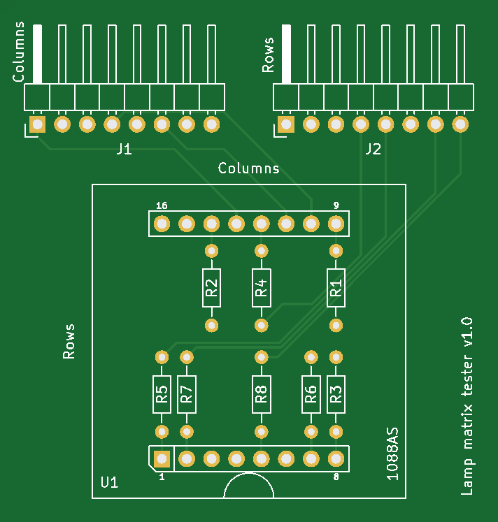

# Pinball lamp matrix tester

A Pinball lamp matrix testing board using a 1088AS 8x8 led matrix module

Bom:

- 8x resistors (from 300Ohms to whatever you want depending on the voltage you apply and brightness you want).
- 1x 1088AS module with 8x8 leds (32mm x 32mm).
- 2x 1x8 female pin header.
- 2x 1x8pins horizontal header (2.54mm).

Notes:
- Resistors values ranges from 300Ohms to whatever value you want  depending on the voltage you apply and brightness you want to achieve.
- The female pin headers act as a socket for the 1088AS for easy replacement and also elevate it above the resistors.